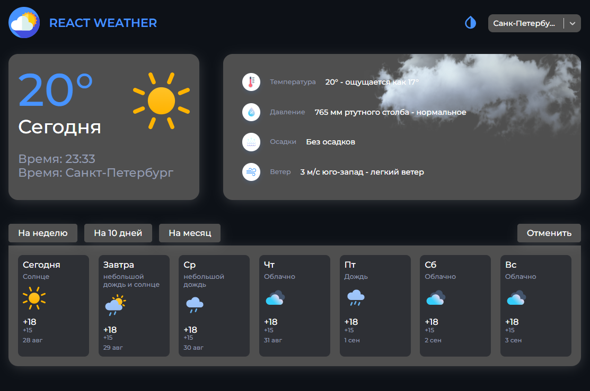
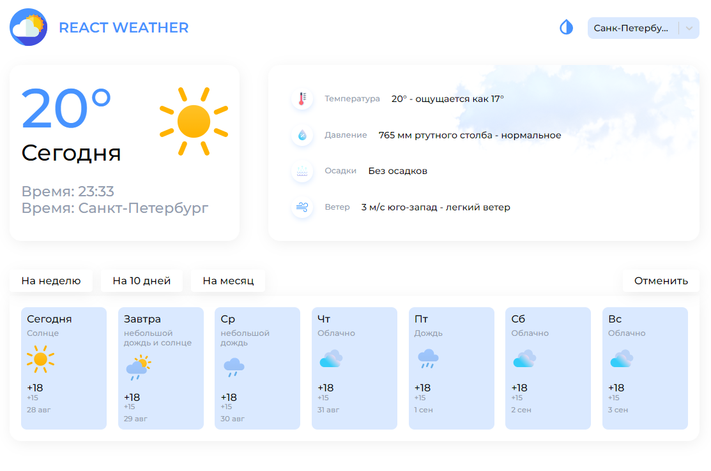

# React Weather


 

Weather App build with React/TypeScript.

## Tech Stack
___
React, TypeScript, Redux, Scss

## Getting Started 
___
First you need an API key from OpenWeatherMap, you can get one by creating an account on their website. After you got your API key, create a .env file at root directory of project, copy the line below to the file and replace YOUR_KEY with your OpenWeatherMap API Key.

```
REACT_APP_API_KEY = YOUR_KEY
```

Finally clone this repository, install dependencies and run the local server.

```
git clone https://github.com/guysnroze/weather-ts
```
```
cd weather-ts
yarn init
yarn start
```
## Credits
___
[OpenWeatherMap](https://openweathermap.org/api) (Weather data API)
